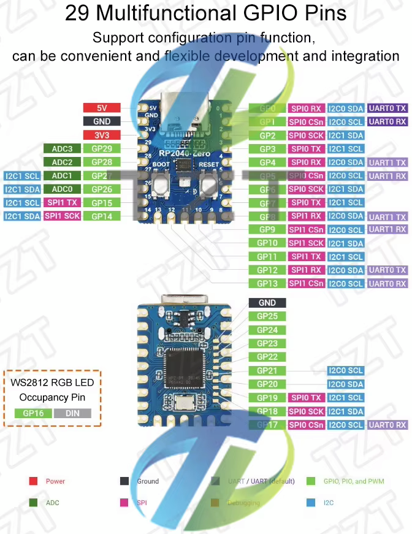

# Raspberry Pi Pico RP2040 clone 16 MB, RP2040-Zero 2 MB

  

VCC-GND.COM - YD-RP2040 GPIO dijagram

TZT RP2040-Zero GPIO dijagram

Micropython kod za Raspberry Pi Pico i "kineske klonove".

**file_manager.py**

Skripta za obavljanje osnovnih radnji s datotekama i direktorijima.

**rpi_cpu_set_MHz.py**

Skripta za postavljanje frekvencije RP2040 procesora u rasponu od 125 MHz do 250 MHz.

**sysinfo.py**

Skripta za ispis sistemskih informacija vezano uz cpu, ram, flash, datum, uptime, sadržaj flash memorije.

**led_onboard.py**

Skripta blinkanja led lampice na ploči mikrokontrolera spojenoj na Pin 25.

**led_onboard-pwm_brightness-data_txt.py**

Skripta blinkanja led lampice na ploči mikrokontrolera s kontrolom količine svjetlosti. Vrši se ispis vrijednosti osvjetljenja led lampice i pretvorba u pripadnu vrijednost napona u terminalu i isti podaci se zapisuju u datoteku pwm_data.txt.

**ssd1306_i2c_check_20-21-gnd-3V3.py**

Skripta provjere postojanja funkcionalnog I2C uređaja povezanog s RP2040

**Kolekcija ssd1306 skripti**

ssd1306_3d-cube-fps.py3d - žičani model kocke rotira na ssd1306 128x32 zaslonu.

ssd1306_clock-128x32.py - sat na ssd1306 128x32 zaslonu.

ssd1306_clock-128x64.py - sat na ssd1306 128x64 zaslonu.

ssd1306_date-clock-128x32.py - datum i sat na ssd1306 128x32 zaslonu.

ssd1306_date-clock-128x64.py - datum i sat na ssd1306 128x64 zaslonu.

ssd1306_random_circles_fps.py - krugovi na ssd1306 128x32 zaslonu po slučajnom odabiru položaja i veličine polumjera uz prikaz fps-a.

ssd1306_random_circles_squares_fps.py - krugovi i kvadrati na ssd1306 128x32 zaslonu po slučajnom odabiru položaja i veličine polumjera uz prikaz fps-a.

ssd1306_random_squares_fps.py - kvadrati na ssd1306 128x32 zaslonu po slučajnom odabiru položaja i veličine polumjera uz prikaz fps-a.

ssd1306_random_triangles_fps.py - trokuti na ssd1306 128x32 zaslonu po slučajnom odabiru položaja i veličine polumjera uz prikaz fps-a.

RP2040-demo.py - animacija za ssd1306 zaslon.

